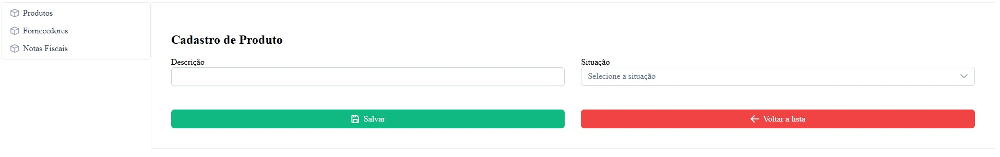
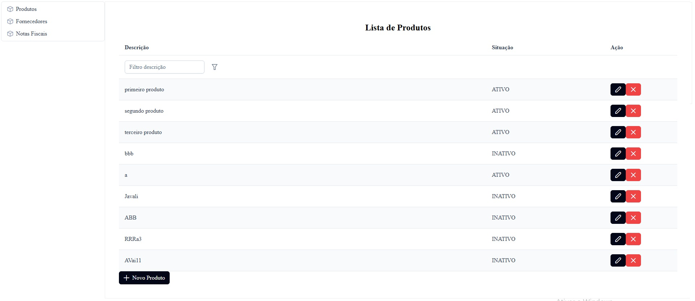
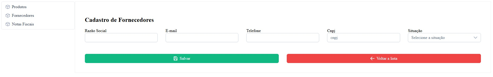
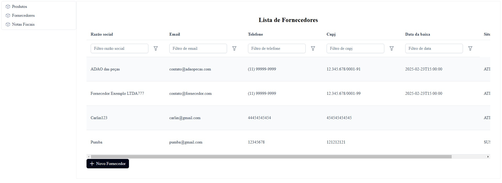
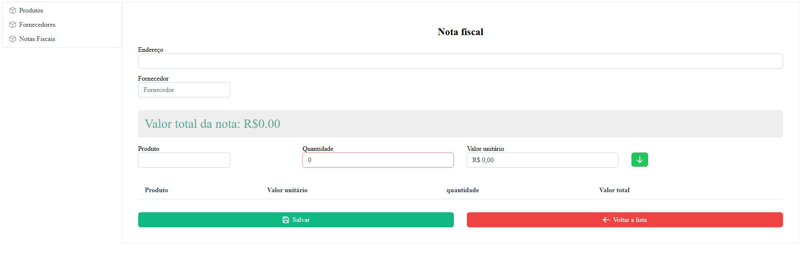
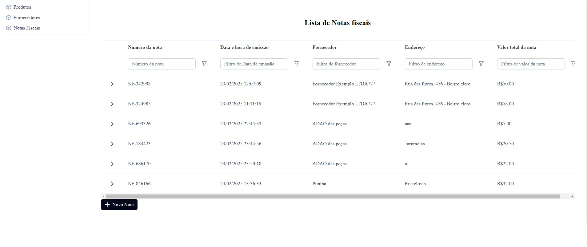

# AppAngularEPrimeNg

Parte front-end do sistema para cadastro de Produto, Fornecedor e Nota fiscal

## Executando o aplicativo no modo dev

```bash
ng serve
```

Após subir a aplicação entre nessa URL `http://localhost:4200/`.

## Oque foi usado

- Angular 19.1
- PrimeNg 19


## Telas do projeto

### Cadastro Produto


### Lista Produto



### Cadastro Fornecedor



### Lista Fornecedor



### Gera Nota



### Lista Notas


